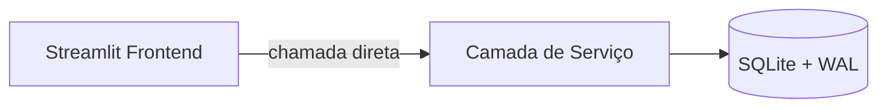

# 🚗 SCCPV — Sistema de Captura e Consulta de Preços de Veículos

<div align="center">

[](https://python.org)
[](https://streamlit.io)
[](https://sqlmodel.tiangolo.com)
[](LICENSE)
[](#)

**Plataforma end‑to‑end para gestão inteligente do ciclo de vida da precificação de veículos**

*War Room Sprint · 5 dias · Arquitetura Monolito Modular*

</div>

---

## 📑 Índice Interativo

- [🌟 Metodologia STAR](#-metodologia-star)
- [🏗️ Escolhas Arquiteturais](#%EF%B8%8F-escolha-de-arquitetura)
- [📁 Estrutura do Projeto](#-estrutura-do-projeto)
- [👥 Perfis de Utilizador](#-perfis-de-utilizador-e-credenciais)
- [🧪 Guia de Demonstração](#-guia-de-demo-passo-a-passo)
- [⚙️ Instalação e Execução](#%EF%B8%8F-instalação-e-execução)
- [🚀 Roadmap · Fase 2](#-escalabilidade-e-roadmap-fase-2)

---

## 🌟 Metodologia STAR

<details open>
<summary><b>Situação · Tarefa · Ação · Resultado</b></summary>

<br>

| Etapa       | Descrição                                                                                                                                                                                                 |
|-------------|------------------------------------------------------------------------------------------------------------------------------------------------------------------------------------------------------------|
| **Situação**  | Dados fragmentados de preços de veículos, falta de padronização nos catálogos e ausência de uma base histórica acessível para consulta pública.                                                             |
| **Tarefa**    | Construir um **MVP em 5 dias** que padronizasse catálogos, gerisse hierarquias de permissão, permitisse recolhas mobile‑first e calculasse médias de mercado em tempo real.                                 |
| **Ação**      | Adoção de **Monolito Modular**, **SQLite WAL**, processamento **Batch (ETL)** e integração resiliente com a API FIPE.                                                                                       |
| **Resultado** | MVP 100% funcional, seguro e auditável, com tempo de resposta inferior a **100 ms** para o utilizador final.                                                                                               |

</details>

---

## 🏗️ Escolha De Arquitetura

Para cumprir um prazo agressivo sem comprometer a qualidade, tomámos decisões técnicas não convencionais — porém altamente eficientes.

### 1️⃣ Monolito Modular (Service‑Based)



> **Zero latência de rede interna** – sem APIs REST desnecessárias.  
> O Streamlit invoca diretamente as classes Python de serviço, eliminando duplicidade de código (*serializers*, *routers*) e acelerando drasticamente a entrega.

### 2️⃣ SQLite com Modo WAL (*Write‑Ahead Logging*)

```sql
PRAGMA journal_mode = WAL;
PRAGMA synchronous = NORMAL;
```

- **Leituras** (consultas públicas) e **escritas** (recolhas no terreno) ocorrem **concorrentemente**.
- Solução robusta para múltiplos pesquisadores em campo, sem o erro clássico `database is locked`.

### 3️⃣ Data Warehouse Leve · Processamento Batch

| Componente        | Responsabilidade                                                                                               |
|-------------------|----------------------------------------------------------------------------------------------------------------|
| `VehicleCapture`  | Recolhas brutas inseridas pelos pesquisadores.                                                                 |
| `AnalyticsService`| **Script Batch** que consolida dados → calcula médias / mínimos / máximos → realiza *Upsert* na tabela otimizada. |
| `MonthlyAverage`  | Tabela de leitura ultra‑rápida para as consultas públicas (estilo Tabela FIPE).                                 |

### 4️⃣ Resiliência com API FIPE vs. Dados Mockados

- O módulo `fipe_importer.py` implementa **Retry com Backoff Exponencial** para lidar com rate‑limit (`HTTP 429`).
- Para **demonstrações controladas**, o script `create_mock_data.py` gera um ambiente 100% previsível, perfeito para avaliações.

---

## 📁 Estrutura do Projeto

```
sccpv-platform/
├── app.py                      # Entrypoint principal (roteamento Streamlit)
├── create_mock_data.py         # Gera ambiente de demonstração
├── reset_and_seed.py           # Seed alternativo (carga parcial da API FIPE)
├── src/
│   ├── database/
│   │   └── connection.py       # Engine SQLModel + pragmas SQLite
│   ├── models/
│   │   └── __init__.py         # Tabelas: User, Brand, Model, Store, Capture...
│   ├── security/
│   │   └── __init__.py         # Hashes e verificação de credenciais
│   ├── services/
│   │   ├── analytics_service.py # Processamento Batch + UserQuery
│   │   ├── auth_service.py      # Autenticação e gestão de sessão
│   │   └── fipe_importer.py     # ETL robusto para API FIPE oficial
│   └── ui/
│       ├── login.py             # Interface de autenticação
│       ├── public_search.py     # Consulta pública (sem login)
│       └── dashboards/          # Dashboards por perfil de acesso
└── README.md
```

---

## 👥 Perfis de Utilizador e Credenciais

> 🔐 **Palavra‑passe padrão para todos os utilizadores de teste:** `123456`  
> *Gerado automaticamente ao executar `create_mock_data.py`.*

| Perfil            | E‑mail de Teste          | Responsabilidade Principal                                                       |
|-------------------|--------------------------|----------------------------------------------------------------------------------|
| **Público**       | *(sem login)*            | Consulta a média de mercado de qualquer veículo.                                  |
| **Administrador** | `admin@sccpv.com`        | Cadastro e gestão de permissões de todos os utilizadores do sistema.              |
| **Coordenador**   | `roberto@sccpv.com`      | Aprova lojas pendentes e gera a agenda de visitas para os pesquisadores.          |
| **Pesquisador**   | `ana@sccpv.com`          | Interface **Mobile‑First**. Executa recolhas de preços nas lojas agendadas.       |
| **Gerente**       | `carlos@sccpv.com`       | Visualiza KPIs, tendências e gere o catálogo mestre (Marcas / Modelos).           |
| **Lojista**       | `fernanda@sccpv.com`     | Solicita o registo da sua concessão / loja para ser incluída no radar do sistema. |

---

## 🧪 Guia de Demo (Passo a Passo)

Siga este guião para demonstrar **todo o fluxo de valor do sistema**:

| #   | Ação                               | Detalhes                                                                                                                                                                                                 |
|-----|------------------------------------|----------------------------------------------------------------------------------------------------------------------------------------------------------------------------------------------------------|
| 1️⃣  | **Consulta Pública Inicial**       | Sem login, pesquise *Toyota Corolla 2023*. O sistema exibe a média mockada inicial.                                                                                                                       |
| 2️⃣  | **Ação do Lojista**                | Login como `fernanda@sccpv.com`. Verifique que a loja está com estado *Pendente*.                                                                                                                         |
| 3️⃣  | **Ação do Coordenador**            | Login como `roberto@sccpv.com`. No separador *Aprovar Lojas*, aprove a loja da Fernanda. Em *Agendas*, veja a atribuição da pesquisadora Ana à *Garagem Central*.                                          |
| 4️⃣  | **Recolha no Terreno**             | Login como `ana@sccpv.com`. Visualize a visita do dia, selecione *Toyota Corolla* e insira um preço real (ex: **R$ 130.000,00**). Guarde a recolha.                                                       |
| 5️⃣  | **Cálculo Batch · Visão Executiva**| Login como `admin@sccpv.com` (ou Gerente). Execute a função *Processar Médias*. O sistema consolida a recolha da Ana e atualiza a tabela `MonthlyAverage`.                                                |
| 6️⃣  | **Fecho**                          | Retorne à consulta pública (sem login) e pesquise novamente o *Corolla*. A **média de mercado foi atualizada com sucesso**.                                                                               |

---

## ⚙️ Instalação e Execução

> 💡 **Recomendação:** utilize o gestor de pacotes [`uv`](https://github.com/astral-sh/uv) para máxima velocidade.

```bash
# 1. Clonar o repositório
git clone https://github.com/teu-utilizador/sccpv-platform.git
cd sccpv-platform

# 2. Instalar dependências (com uv)
uv sync

# 3. Gerar cenário de demonstração (Base de Dados)
uv run python create_mock_data.py

# 4. Iniciar a plataforma
uv run streamlit run app.py
```

🌐 A aplicação estará disponível em: **[http://localhost:8501](http://localhost:8501)**

---

## 🚀 Escalabilidade e Roadmap (Fase 2)

A arquitetura foi projetada para **substituir componentes sem reescrever a lógica de negócio**.

| Meta                     | Estratégia                                                                                          |
|--------------------------|------------------------------------------------------------------------------------------------------|
| **Escalabilidade**       | Substituir a *string* de conexão do SQLite por **PostgreSQL**, suportando acessos massivos concorrentes. |
| **APIs REST**            | Expor a camada `src/services` através de **FastAPI**, criando endpoints padronizados.                 |
| **Aplicação Nativa**     | Desenvolvimento de um **app React Native** para pesquisadores, com funcionamento **100% offline‑first**.    |
| **Data Science**         | Implementação de algoritmos de **predição de desvalorização** sobre o *Data Warehouse* histórico.     |

---

<div align="center">

**Desenvolvido como Projeto de Entrega Acelerada**  
<br>
*Irlan Wallace S. Mattos*  
<br>
[](https://github.com/teu-utilizador)

</div>
```

---

